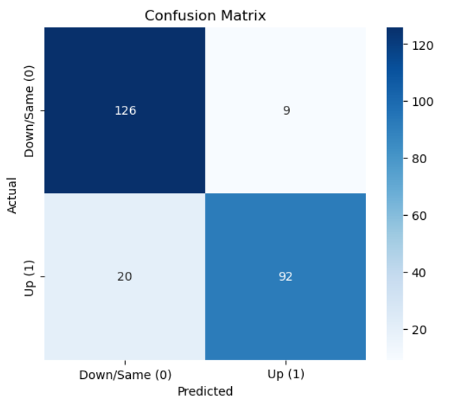
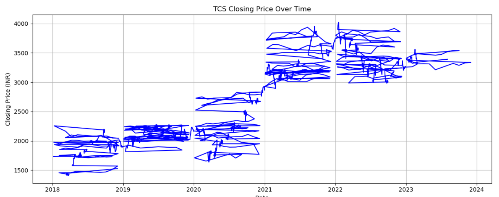
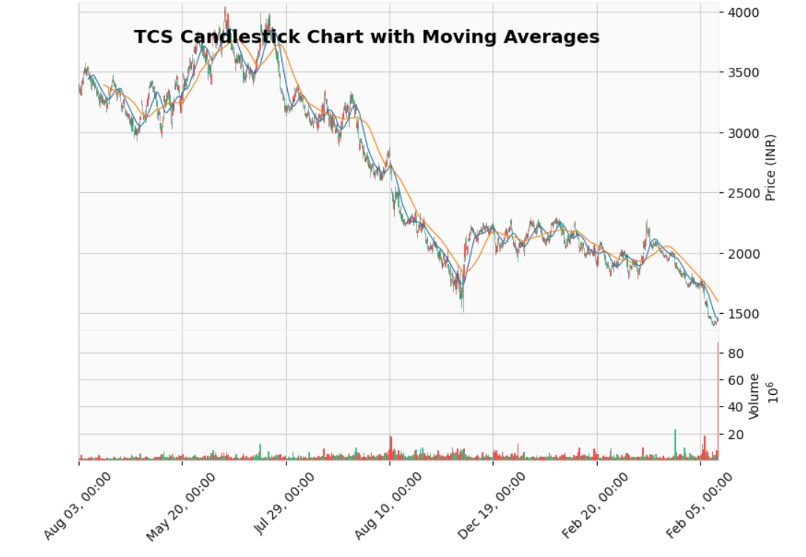
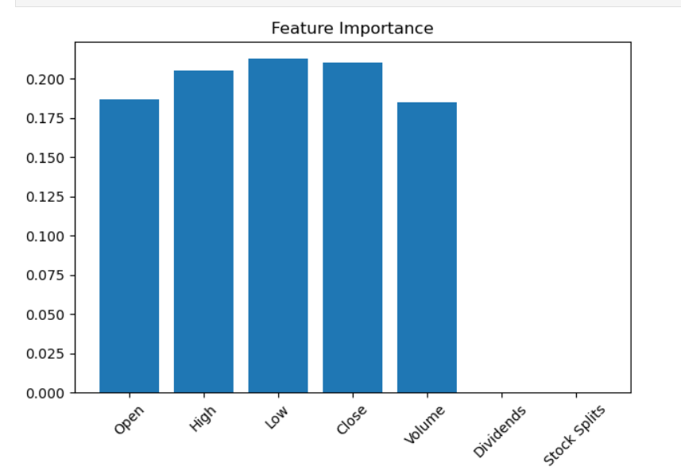

# 🧠 TCS Stock Price Prediction Using Machine Learning

This project applies supervised machine learning algorithms to predict stock movement for **Tata Consultancy Services (TCS)** using historical market data. The models explore both classification and regression approaches to capture price behavior and build predictive insights.

## 📁 Project Structure

## 📊 Algorithms Used

| Model               | Purpose                                 | Notes                                        |
|--------------------|------------------------------------------|----------------------------------------------|
| Logistic Regression | Classification of upward/downward movement | Simple baseline, interpretable               |
| Decision Tree       | Non-linear feature splitting              | Useful for feature importance analysis       |
| Random Forest       | Ensemble decision trees                   | Reduces overfitting, better generalization   |
| XGBoost             | Gradient boosting optimization            | High performance with tuned hyperparameters  |
| SVM                 | Margin-based classification               | Good for high-dimensional data               |

## ⚙️ Features & Target

- **Features**: Open, High, Low, Close, Volume, Moving Averages, Volatility Index
- **Target**: Binary movement prediction (Up = 1, Down = 0)

## 📈 Evaluation Metrics

- Accuracy
- Precision, Recall, F1-score
- ROC-AUC
- Confusion Matrix
- Cross-validation scores

## 📊 Model Performance: Confusion Matrix

This matrix summarizes the results of our classification model's predictions:

|                      | Predicted: Down/Same (0) | Predicted: Up (1) |
|----------------------|--------------------------|--------------------|
| **Actual: Down/Same (0)** | True Negatives: **126**     | False Negatives: **20** |
| **Actual: Up (1)**         | False Positives: **9**      | True Positives: **92**  |

🔹 **Accuracy**: High accuracy demonstrated with strong performance across both classes.  
🔹 **Insights**: Minimal false positives/negatives indicate a well-balanced model.

## 📈 Stock Trend Analysis: TCS Closing Price Over Time

The following graph illustrates the historical closing prices of **Tata Consultancy Services (TCS)** from **2018 to 2023** in INR. This visualization helps in understanding long-term stock trends, volatility, and investment insights.

## 🕯️ TCS Candlestick Chart with Moving Averages

This chart represents the **candlestick pattern** of Tata Consultancy Services (TCS) stock over a period from **August 3 to February 5**, including **moving averages** and **trading volume data**.

🔍 **Chart Features**:
- **Candlesticks**: Show daily price movements with open, high, low, and close values.
- **Moving Averages**: Smooth out volatility and highlight trends in stock behavior.
- **Volume Bars**: Help identify the strength behind price movements.

📈 **Use Case**: Ideal for performing **technical analysis**, spotting reversal patterns, and validating price signals with volume data.

## 🧠 Feature Importance Analysis

This bar chart reveals how influential each feature was in our prediction model for TCS stock trends.

📊 **Key Observations**:
- **High, Low, Close** values carry the **most weight**, indicating their strong predictive power.
- **Volume and Open** also contribute significantly, though slightly less.
- **Dividends & Stock Splits** had **no measurable impact** in this dataset.

🔍 **Implication**: Focusing on price metrics enhances model accuracy, while dividends and splits can be deprioritized or excluded for this use case.

